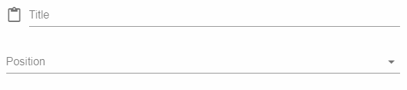
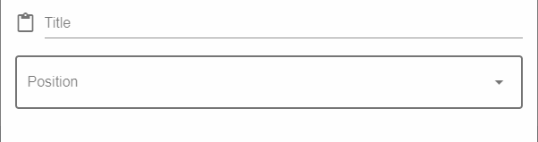

# Dynamic Forms

Forms depends on [Vuetify](https://vuetifyjs.com/en/components/text-fields)'s components.

Dynamic forms consists of two main components:

- [Dynamic form](#dynamic-form)
- [Dynamic form field](#dynamic-form-field)

And it provides convenient API to generate forms with basic info that you will provide through **JSON**:
    *Here shoud be examples*

<!-- Reasons to divide to two components is that  -->

## Dynamic form

Currently on dev...

## Dynamic form field

Usually process of building forms is that you have some basic set of props that provide some styling that will not change and you write this set of props over and over, so you don't follow **DRY**(Do not Repeat Yourself) principle. And it can make some problems:

- When you decide to change base styling for form fields, you shoud edit every field separately.
- The lines of code will be more

So this component contains a basic set of props for every field component that provide default styling. And you can add only unique and necessary info about field, and it will **generate** form field, and add those default set of props:

```HTML
<form-field :field="{
    type: 'string',
    name: 'title',
    label: 'Title',
    icon: 'content_paste',
}"/>

<form-field :field="{
    type: 'select',
    name: 'positionId',
    label: 'PositionLevel',
    items: positionLevels,
}"/>
```

It will generate:



For situations that field has some unique **prop** or **prop value** you can override those props by adding **props** object to JSON and define prop values there:

```HTML
<form-field :field="{
    type: 'string',
    name: 'title',
    label: 'Title',
    icon: 'content_paste',
}"/>

<form-field :field="{
    type: 'select',
    name: 'positionId',
    label: 'PositionLevel',
    items: positionLevels,
    props:{
        outline: true
    }
}"/>
```

It will generate:



## API

### Field types

Main **property** of field's JSON representation is ***type*** property, it can be one of these:

- [input](#input)
- [string](#string)
- [text](#text)
- [number](#number)
- [select](#select)
- [autocomplete](#autocomplete)
- [combobox](#combobox)
- [users](#users)
- [date](#date)
- [time](#time)
- [date-time](#date-time)

#### *input*

It's simple input element for storing some tokens and etc.

##### Default component

```HTML
<input
    :name="field.name"
    :value="field.value"
    type="hidden"
/>
```

#### *string*

Plain string field

##### Default component

```HTML
<v-text-field
    :name="field.name"
    :label="field.label"
    :rules="field.rules"
    :hint="field.hint"
    :prepend-icon="field.icon"
/>
```

#### *text*

Text field that **has by default 3 rows**

##### Default component

```HTML
<v-text-field
    :name="field.name"
    :label="field.label"
    :rules="field.rules"
    :hint="field.hint"
    :prepend-icon="field.icon"
    rows="3"
/>
```

#### *number*

Number field, value which by default **have to be greater than one**, so if you want to override this, you shoud define it in JSON.

##### Default component

```HTML
<v-text-field
    :name="field.name"
    :label="field.label"
    :rules="field.rules"
    :hint="field.hint"
    :prepend-icon="field.icon"
    min="1"
/>
```

#### *select*

Field with options to select

##### Default component

```HTML
<v-select
    :name="field.name"
    :label="field.label"
    :rules="field.rules"
    :hint="field.hint"
    :prepend-icon="field.icon"
    :items="field.items"
    :multiple="field.multiple"
    item-text="name"
    item-value="id"
/>
```

#### *autocomplete*

Autocomplete field with options to select, **the diffirence beetwen select is that it has search and you can use it for multiple selection**

##### Default component

```HTML
<autocomplete>
    <v-autocomplete
        :name="field.name"
        :label="field.label"
        :rules="field.rules"
        :hint="field.hint"
        :prepend-icon="field.icon"
        :items="field.items"
        :multiple="field.multiple"
        item-text="name"
        item-value="id"
        no-data-text="Данные отсутствуют"
        color="primary"
        persistent-hint
        hide-selected
    />
</autocomplete>
```

#### *combobox*

Field with options to select, the diffirence beetwen select and autocomplete is that: **you can addi new items**.
It will submit two input one with original name that was passed through JSON, and another with ***new+name*** which will contain new added items.

##### Default component

```HTML
<combobox>
    <v-combobox
        :label="field.label"
        :rules="field.rules"
        :hint="field.hint"
        :prepend-icon="field.icon"
        :items="field.items"
        :item-text="name"
        :multiple="field.multiple"
        no-data-text="Данные отсутствуют"
        color="primary"
        persistent-hint
        hide-selected
    />
    <input
        type="hidden"
        :name=" 'new' + field.name"
        :value="newSelectedItems"
    />
    <input
        type="hidden"
        :name="field.name"
        :value="selectedItems"
    />
</combobox>
```

#### *users*

Field with list of persons with avatar, name and positionLevel, serves for selecting users

##### Default component

```HTML
<user-selector
    :name="field.name"
    :label="field.label"
    :rules="field.rules"
    :hint="field.hint"
    :icon="field.icon"
    :users="field.users"
    :multiple="field.multiple"
/>
```

#### *date*

Date picker, submits input with value of date string, in format **dd-mm-yyyy**.
And it contains three components

##### Default component

```HTML
<v-dialog
    :width="width ? width : '290px'"
    lazy
>
    <v-text-field
        :name="field.name"
        :label="field.label"
        :rules="field.rules"
        :prepend-icon="field.icon"
        readonly
    />
    <v-date-picker
        color="primary"
        min="field.min"
        max="field.max"
        scrollable
    />
</v-dialog>
```

to add or override props use this syntax:

```HTML
<form-field :field="{
    props: {
        dialog: {
            width: '400px'
        },
        textField: {
            outline: true
        },
        picker: {
            color: 'green lighten-3'
        }
    }
}"/>
```

#### *time*

Time picker, submits input with value of time string, in format **hh:mm**.
Same components and **synatax** as for [*date*](#date), but instead of:

```HTML
<v-date-picker
    color="primary"
    min="field.min"
    max="field.max"
    scrollable
/>
```

has this default component:

```HTML
<v-time-picker
    color="primary"
    min="field.min"
    max="field.max"
    scrollable
/>
```

#### *date-time*

Date and time picker, submits input with value of date and time string, in format **dd-mm-yyyy hh:mm**.
Same components and **synatax** as for [*date*](#date), but instead of:

```HTML
<v-date-picker
    color="primary"
    min="field.min"
    max="field.max"
    scrollable
/>
```

has this default component:

```HTML
<v-date-picker
    color="primary"
    min="field.min"
    max="field.max"
    scrollable
>

// Here is recursive time picker

</v-date-picker>
```
